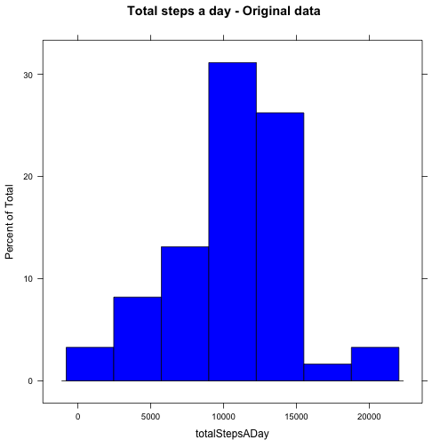
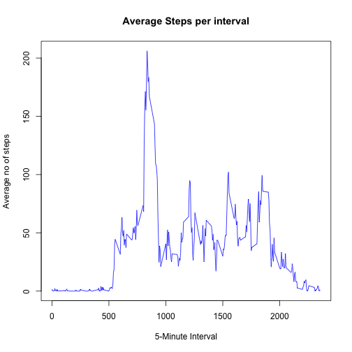
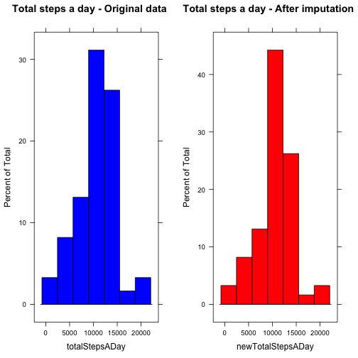
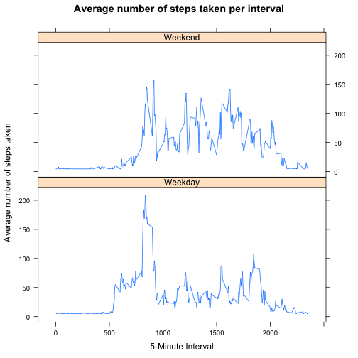

Reproducible Research - Assignment 1
=======================================================

This assignment makes use of data from a personal activity monitoring device. This device collects data at 5 minute intervals through out the day. The data is collected over two months and include the number of steps taken in 5 minute intervals each day. It is stored in a comma-separated-value (CSV) file called activity.csv.

The assignment calculates values like the total number of steps per day, their mean and median, average number of steps per interval, imputes missing values and finds if there are any differences in activity patterns between weekdays and weekends. It also has lattice plots for better understanding.

The lattice library needs to be loaded in order to create the lattice plots.


```r
library(lattice)
```

Loading and preprocessing the data
----------------------------------------

The data is first read from the file 'activity.csv' and loaded into the 'data' object. Then, the data is preprocessed such that the character values in 'date' column is converted into 'Date' values.


```r
data <- read.csv("~/DEVHOME/COURSERA/R/activity.csv")
data$date <- as.Date(data$date)
```

What is mean total number of steps taken per day?
----------------------------------------------------

The total number of steps taken per day is calculated as below.


```r
totalStepsADay <- tapply(data$steps, data$date, sum)
totalStepsADay
```

```
## 2012-10-01 2012-10-02 2012-10-03 2012-10-04 2012-10-05 2012-10-06 
##         NA        126      11352      12116      13294      15420 
## 2012-10-07 2012-10-08 2012-10-09 2012-10-10 2012-10-11 2012-10-12 
##      11015         NA      12811       9900      10304      17382 
## 2012-10-13 2012-10-14 2012-10-15 2012-10-16 2012-10-17 2012-10-18 
##      12426      15098      10139      15084      13452      10056 
## 2012-10-19 2012-10-20 2012-10-21 2012-10-22 2012-10-23 2012-10-24 
##      11829      10395       8821      13460       8918       8355 
## 2012-10-25 2012-10-26 2012-10-27 2012-10-28 2012-10-29 2012-10-30 
##       2492       6778      10119      11458       5018       9819 
## 2012-10-31 2012-11-01 2012-11-02 2012-11-03 2012-11-04 2012-11-05 
##      15414         NA      10600      10571         NA      10439 
## 2012-11-06 2012-11-07 2012-11-08 2012-11-09 2012-11-10 2012-11-11 
##       8334      12883       3219         NA         NA      12608 
## 2012-11-12 2012-11-13 2012-11-14 2012-11-15 2012-11-16 2012-11-17 
##      10765       7336         NA         41       5441      14339 
## 2012-11-18 2012-11-19 2012-11-20 2012-11-21 2012-11-22 2012-11-23 
##      15110       8841       4472      12787      20427      21194 
## 2012-11-24 2012-11-25 2012-11-26 2012-11-27 2012-11-28 2012-11-29 
##      14478      11834      11162      13646      10183       7047 
## 2012-11-30 
##         NA
```

A histogram of the total number of steps per day is created.


```r
originalPlot <- histogram(totalStepsADay, col = "blue", 
                main = "Total steps a day - Original data")
print(originalPlot)
```

 

The mean value of the total number of steps taken per day is calculated.


```r
meanValuePerDay <- mean(totalStepsADay, na.rm = TRUE)
meanValuePerDay
```

```
## [1] 10766.19
```

The median value of the total number of steps taken per day is calculated.


```r
median(totalStepsADay, na.rm = TRUE)
```

```
## [1] 10765
```

What is the average daily activity pattern?
----------------------------------------------

The average number of steps taken per interval across all days is calculated.


```r
avgStepsPerInterval <- tapply(data$steps, data$interval, mean, na.rm = TRUE)
```

A time series plot of the 5-minute interval and the average number of steps taken, averaged across all days is created.


```r
plot(names(avgStepsPerInterval), avgStepsPerInterval, type = "l",
     main = "Average Steps per interval", 
     xlab = "5-Minute Interval", ylab = "Average no of steps", col = "blue")
```

 

The below 5-minute interval, on average across all the days in the dataset, contains the maximum number of steps.


```r
data$interval[which.max(avgStepsPerInterval)]
```

```
## [1] 835
```

Imputing missing values
---------------------------

The missing values (NA) in steps may introduce bias into some calculations or summaries of the data.  

The number of missing values is first reported.


```r
numberOfMissingValues <- sum(!complete.cases(data))
numberOfMissingValues
```

```
## [1] 2304
```

Let us replace the NA values in a day with the average number of steps (mean) taken on the same day. If a date contains only NA values for steps, we can replace all the values with the average of mean total number of steps per day, that is, meanValuePerDay/total no.of observations in a day.


```r
totalObsADay <- nrow(split(data, data$date)[[1]])
modifiedSteps <- tapply(data$steps, data$date, 
                       function(x){
                        y <- mean(x, na.rm = TRUE)
                        if (is.nan(y)) y <- meanValuePerDay/totalObsADay
                        x[is.na(x)] <- y
                        x
                        })
```

A new dataset that is equal to the original dataset but with the missing data replaced with mean values is created.


```r
newData <- data.frame(steps = unlist(unname(modifiedSteps)), 
                      date = data$date, 
                      interval = data$interval)
```

The total number of steps taken per day is calculated again.


```r
newTotalStepsADay <- sapply(modifiedSteps, sum)
newTotalStepsADay
```

```
## 2012-10-01 2012-10-02 2012-10-03 2012-10-04 2012-10-05 2012-10-06 
##   10766.19     126.00   11352.00   12116.00   13294.00   15420.00 
## 2012-10-07 2012-10-08 2012-10-09 2012-10-10 2012-10-11 2012-10-12 
##   11015.00   10766.19   12811.00    9900.00   10304.00   17382.00 
## 2012-10-13 2012-10-14 2012-10-15 2012-10-16 2012-10-17 2012-10-18 
##   12426.00   15098.00   10139.00   15084.00   13452.00   10056.00 
## 2012-10-19 2012-10-20 2012-10-21 2012-10-22 2012-10-23 2012-10-24 
##   11829.00   10395.00    8821.00   13460.00    8918.00    8355.00 
## 2012-10-25 2012-10-26 2012-10-27 2012-10-28 2012-10-29 2012-10-30 
##    2492.00    6778.00   10119.00   11458.00    5018.00    9819.00 
## 2012-10-31 2012-11-01 2012-11-02 2012-11-03 2012-11-04 2012-11-05 
##   15414.00   10766.19   10600.00   10571.00   10766.19   10439.00 
## 2012-11-06 2012-11-07 2012-11-08 2012-11-09 2012-11-10 2012-11-11 
##    8334.00   12883.00    3219.00   10766.19   10766.19   12608.00 
## 2012-11-12 2012-11-13 2012-11-14 2012-11-15 2012-11-16 2012-11-17 
##   10765.00    7336.00   10766.19      41.00    5441.00   14339.00 
## 2012-11-18 2012-11-19 2012-11-20 2012-11-21 2012-11-22 2012-11-23 
##   15110.00    8841.00    4472.00   12787.00   20427.00   21194.00 
## 2012-11-24 2012-11-25 2012-11-26 2012-11-27 2012-11-28 2012-11-29 
##   14478.00   11834.00   11162.00   13646.00   10183.00    7047.00 
## 2012-11-30 
##   10766.19
```

A histogram with the new total number of steps taken per day is created.


```r
ImputedPlot <- histogram(newTotalStepsADay, col = "red", 
               main = "Total steps a day - After imputation")
print(originalPlot, position = c(0, 0, 0.5, 1), more = TRUE)
print(ImputedPlot, position = c(0.5, 0, 1, 1))
```

 

It can be seen that there is some difference between the histograms of the original data and the imputed data. The bins are of different heights but they average each other out so that the mean and median values are unchanged as shown below.

The new mean and median values of total number of steps taken per day are calculated.


```r
mean(newTotalStepsADay, na.rm = TRUE)
```

```
## [1] 10766.19
```

```r
median(newTotalStepsADay, na.rm = TRUE)
```

```
## [1] 10766.19
```

Again, imputing missing values has no impact on the mean and median values in the new dataset. The values remain the same after imputation.

Are there differences in activity patterns between weekdays and weekends?
----------------------------------------------------------------------------

Let us use the new dataset with the filled-in missing values for this part. Let us find out if there are any differences in activity patterns between weekdays and weekends.

A factor variable with two levels - "Weekday" and "Weekend" is created in the dataset.


```r
newData$day <- factor((weekdays(newData$date) %in% c("Saturday", "Sunday"))+1L,
      levels=1:2, labels=c("Weekday", "Weekend"))
table(newData$day)
```

```
## 
## Weekday Weekend 
##   12960    4608
```

The average number of steps taken per interval across all weekdays and weekends is calculated.


```r
avgSteps <- aggregate(steps ~ interval + day, newData, mean)
head(avgSteps)
```

```
##   interval     day    steps
## 1        0 Weekday 7.006569
## 2        5 Weekday 5.384347
## 3       10 Weekday 5.139902
## 4       15 Weekday 5.162124
## 5       20 Weekday 5.073235
## 6       25 Weekday 6.295458
```

A panel plot containing a time-series plot pf the 5-minute interval and the average number of steps taken, averaged across all weekday days or weekend days is created. 


```r
xyplot(steps ~ interval | day, data = avgSteps, type = "l", layout = c(1, 2),
       xlab = "5-Minute Interval", ylab = "Average number of steps taken",
       main = "Average number of steps taken per interval")
```

 

It can be seen from the plot that the weekend activity is, in general, higher throughout the 5-minute intervals than weekend activity but the weekday activity peaks between the 500-1000 5-minute intervals much higher than the weekend activity.


